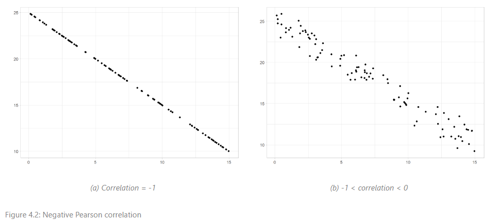

**TL;DR:** Every time I use Quarto, I learn something new! I wanted to start documenting these findings in a blog so others know they exist. This week, I leaned some useful code chunk options and how to add dark mode to make materials more accessible.

## Motivation
Next week, I will be teaching the third edition of my [Statistical Thinking](/courses/9_statistical_thinking/) course to the UK Ministry of Justice. The first edition was written using Google Docs due to tight deadlines (without needing to learn a new language!). This was far from ideal as the course includes many graphs created using the `ggplot2` package in R. Any corrections or updates to the graphs meant a convoluted process of updating code, exporting images, and replacing them in the document. When it came to making updates for the second edition of the course, I could not face going through this process and decided now was the perfect time to learn RMarkdown!

RMarkdown allowed me to incorporate R outputs (specifically tables and graphs) into the course notes which were automatically updated when I changed the code. After overcoming my aversion to LaTeX (I swore to never use it again following many error-induced breakdowns writing my MSc dissertation), I produced a PDF course booklet which looked far more professional than the original version and meant I did not have to wrangle outputs every time I made a tiny change.

**But then I met Quarto.**


As I spoke about [in my previous blog](/blog/quarto_training), I am hosting all my course materials for free online using Quarto books and Netlify. Unlike RMarkdown, Quarto does not require additional packages to create books or websites, and there are some useful additional features that I really like in Quarto that just aren't available in RMarkdown.

Here are some of the useful features that I discovered while converting this course from RMarkdown to Quarto.

## TWIL: This week I learned

### Setting document-level default `knitr` execution settings in YAML
The course I am writing does not include any software training. This means that, although I am using R code to generate graphs and tables in the notes, I do not want this code to be visible to readers. Quarto (and RMarkdown) use the `knitr` package to execute code chunks. To customise the way `knitr` does this, we can use [chunk options](https://yihui.org/knitr/options/). These can be specified for each chunk individually, or can be set at the document-level within YAML:

````
---
knitr:
  opts_chunk: 
    echo: false
    message: false
    fig.align: center
---
````

This code ensures that all code chunks within the document will be executed without displaying code or any messages within the final document, and all figures will be center-aligned.

### Setting individual chunk options using `#|` 
Code chunk execution can still be customised for each chunk individually but, rather than adding this to the chunk headings like RMarkdown, these are added to the body following `#|`. For example,

````
```{r setup, include = FALSE}
library(ggplot2)
```
````

In RMarkdown is a code chunk labelled 'setup' which installs the `ggplot2` package, without displaying the R code or output in the rendered document. In Quarto, this becomes:

````
```{r}
#| include: false
#| label: setup

library(ggplot2)
```
````

This does not change the output significantly but I found it makes the code far more readable. 

### Cross-referencing figures and tables
Setting a chunk label within the chunk body allows cross-references to be created, making it easier to refer to previous outputs within text. Cross-references are useful for figures and tables, but can also be used to reference callouts (more on these soon), equations and sections. Quarto automatically numbers cross-references, meaning we do not need to manually update them if we add new references to the document.

To create a cross-reference for a figure or table created in a code chunk, begin the chunk label with one of the reserved cross-reference prefixes [listed in Quarto documentation](https://quarto.org/docs/authoring/cross-references.html#reserved-prefixes), for example `fig-` or `tbl`. The default syntax to add a reference to text is using the label, beginning with an `@` symbol, e.g. `@fig-plot1`. For other options, see the [Quarto documentation](https://quarto.org/docs/authoring/cross-references.html#references).

### Custom figure layouts to show multiple graphs on one output
One of my favourite discoveries this week is that figure layouts can be cutomised within code chunks. This not only means that multiple plots can be shown on the same output, but they can be each be given sub-captions as well as an overall caption! 

To add multiple plots, we can include the code options `layout-ncol`, `layout-nrow` or `layout` depending on how we want the layout to look. Overall captions are added using the code option `fig-cap` and sub-captions can be added for each sub-plot using `fig-subcap`.

For example, the following code chunk was used to create Figure 4.2 in my upcoming [Statistical Thinking course materials](https://stats-thinking.netlify.app/04_comparisons#identifying-trends-between-two-numeric-variables), showing two examples of negative Pearson correlation coefficients:

````
``` {r}
#| label: fig-negative-correlation
#| layout-ncol: 2
#| fig-cap: "Negative Pearson correlation"
#| fig-subcap:
#|  - "Correlation = -1"
#|  - "-1 < correlation < 0"

ggplot(data = correlation_data) +
  geom_point(aes(x = xcor1, y = ycor_1)) +
  labs(x = "", y = "") +
  theme_light()

ggplot(data = correlation_data) +
  geom_point(aes(x = xcor1, y = ycor_neg)) +
  labs(x = "", y = "") +
  theme_light()

```
````



This avoids needing additional R packages, such as `cowplot` or `patchwork`, to show multiple plots on the same output, and makes it super simple to add sub-captions to each.


### Adding a light/dark mode option to online materials
One comment I received when I first started sharing free materials online was that they lacked a dark mode option. One of my main goals in sharing these materials was to increase accessibility to training, so it was very important to me to rectify this for future materials. Luckily, this is very easy to do in Quarto! 

Within the Quarto configuration file (named `_quarto.yml` by default), we are able to customise the theme of html documents, using one of the [in-built defaults](https://bootswatch.com/) or by creating our own using CSS or SCSS. We are also able to provide separate light and dark themes, for example:

````
format:
  html:
    theme: 
      light: pulse
      dark: darkly
````

This will add a toggle option to the sidebar of the book html output, allowing readers to choose which option they prefer.

## What next?
I am still fairly new to Quarto and its uses, some things I am hoping to finally figure out and share soon!


### Customised callouts 
One of my favourite additions to Quarto are the [callout blocks](https://quarto.org/docs/authoring/callouts.html). There are 5 default types but I would love to create my own customised version for R code 'style tips'. [This blog](https://www.andreashandel.com/posts/2023-06-13-custom-callouts-quarto/) and [this video](https://www.youtube.com/watch?v=DDQO_3R-q74) were very useful but I have still not got it to work yet!

### CSS/SCSS to create a custom theme
I am going to be completely honest with you here: coding outside of R intimidates me a little! One of my goals is to overcome this fear and learn other useful computing languages. Coupled with Quarto, CSS and/or SCSS can be used to create a completely personalised theme for your documents. 

### A Quarto course template
Inspired by a response to a LinkedIn post (thank you James Bartlett for sharing your [workshop](https://bartlettje.github.io/Booktem_demo/)!), I will be developing a customised template to ensure future materials are consistent.

Please do [get in touch](/contact) if you have any advice on these future steps, or if you want to share your experiences creating Quarto materials!

