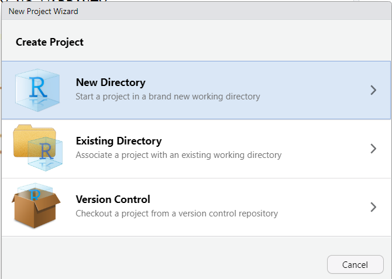
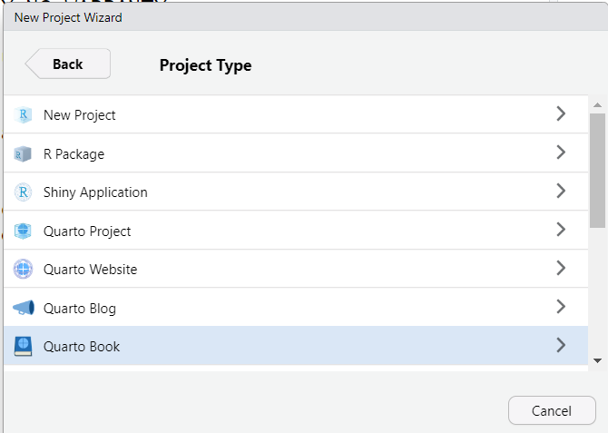
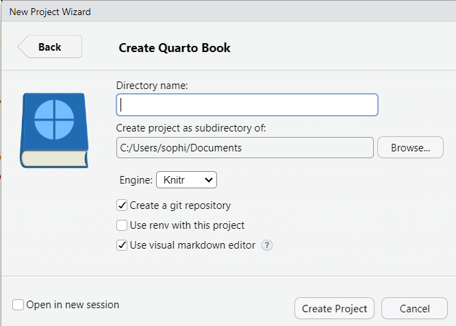
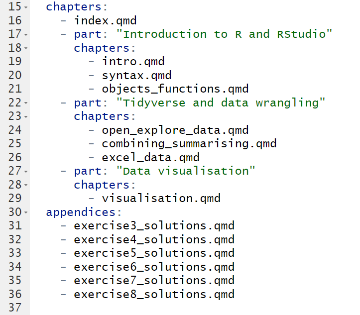
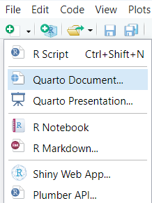
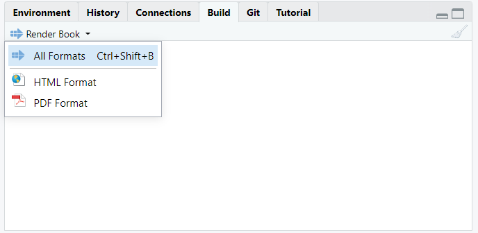
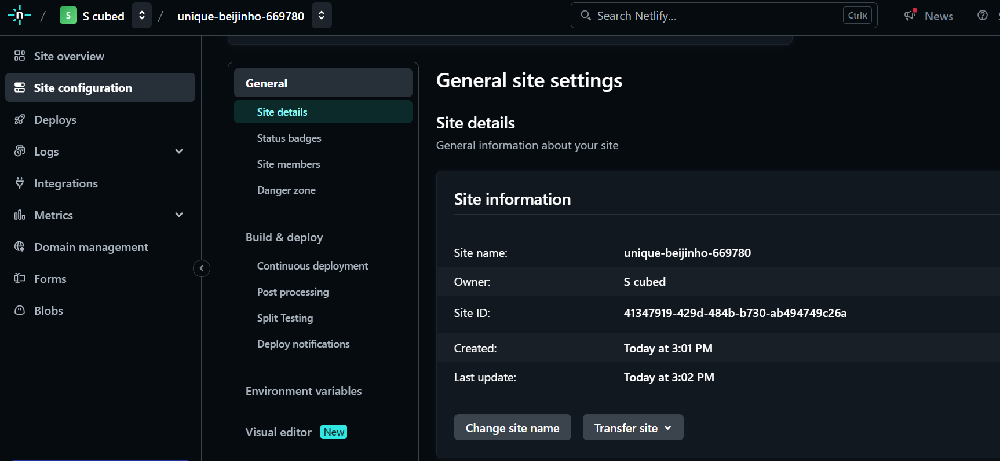

**TL;DR**  A blog post that turned into a short tutorial explaining why Quarto is my weapon of choice when making my training accessible, and how to host materials for free using Netlify.

## Motivation
I am on a mission to make statistics and R coding accessible, inclusive, and enjoyable! Part of this mission includes providing free access to training materials so that anyone who wants to learn has the opportunity to do so (not just those with access to funding). However, I am a freelancer who is not paid to do any of this. Therefore, I require tools that are **free to use** and **free to learn**. After some trial and error, I found that [Quarto](https://quarto.org/) met most of my requirements. 

### What is Quarto?
Quarto is an open-source document publishing system. If you have ever used RMarkdown, Quarto is the new generation which has been extended to include other coding languages (such as python and julia), as well as other useful updates. Quarto allows the easy integration of R code and output into documents, making it particularly useful for writing R coding courses. 

### Why Quarto?
My main motivation for choosing Quarto:

- Free to use
- Has LOTS of free [online documentation](https://quarto.org/docs/guide) and [training courses](https://github.com/mcanouil/awesome-quarto)
- Runs within the RStudio interface 
- Easy to incorporate R code, output, and visualisations into documents
- Compatible with Github, making version control easy and ensuring work is reproducible
- Can produce a wide range of document types, including books and websites, without the need for additional packages

## Writing training materials as Quarto books
[Quarto books](https://quarto.org/docs/books/) are easy to set up and provide a clear structure that combines multiple documents into a single output. When creating training materials, this allows us to create separate documents for each lecture or session. Some well-known free R resources are created using this format, including Hadley Wickham’s [R for Data Science](https://r4ds.hadley.nz/).

The easiest way to create a book in RStudio is to begin a new Quarto book project:



Rather than the standard R project, select 'Quarto Book':



As with standard projects, give the book project a name and select the working directory you want to save it to:



By ticking 'Create a git repository', we are able to link the project to a Github repository. For more information on why and how to do this, I would highly recommend following along with Jenny Bryan's excellent [Happy Git and GitHub for the useR](https://happygitwithr.com/). This provides detailed instructions for linking RStudio with Github and helps to demystify the process!


Creating a Quarto book project in this way will produce a simple book with a landing page (`index.qmd`), two chapters (`intro.qmd` and `summary.qmd`), a bibliography page (`references.qmd` which works with `references.bib`), and a Quarto project file (`_quarto.yml`).

### Configuring the Quarto YAML 
One of the default files created within a Quarto book project is a YAML (**Y**AML **A**in't a **M**arkdown **L**anguage) file which configures the overall configuration of our book. This YAML file will allow us to determine the layout of the book, how it is configured, and how it appears. For a comprehensive list of confirguration options, check the Quarto [reference guide](https://quarto.org/docs/reference/projects/books.html).

Options that you may need to change/add within the default YAML settings include:

- Changing the title, author and date of the book
- Changing/adding chapters to fit with lectures or sessions in your training
- Separating chapters further into 'parts' with their own titles (particularly if lectures cover multiple chapters)
- Adding appendices, particularly useful for exercise solutions or additional reading:



- Choosing the most appropriate output format(s) for the materials 
  - Quarto allows us to create multiple document types within the same process. This is particularly useful where we want to allow students the option to download material to access offline.
  - To add a download button to the book sidebar, add the option `downloads: [pdf]` under the `book` formatting options. Ensure that you have `html` and the downloadable document type listed under the `format` options of the YAML. 
- Customising the themes of your outputs
  - For `html` documents, there are 25 [in-built themes](https://bootswatch.com/) that can be used, or a personalised theme can be added as a `.css` or `.scss` file.
  
### Configuring your 'chapters'
Although Quarto books automatically generate three 'chapters' (the `index.qmd`, `intro.qmd` and `summary.qmd` files), we are not restricted to this layout. These files can be edited or even deleted exactly the same as any other Quarto document. 

*If you do change the name of one of the chapter files, be sure to change it in the `_quarto.yml` book structure to avoid errors!*

To create new chapters, create a new Quarto document in the same way you would an R script or RMarkdown file (but selecting 'Quarto Document from the list of options): 



Quarto documents are made up of (optional) YAML headers, markdown language, and code chunks. 

**YAML headers** are text surrounded by ```---``` at the beginning of a Quarto document. They customise the layout of the document, including the output format, title, and appearances. Unless these settings differ from the `_quarto.yml` configuration file, we do not need a YAML header for each chapter. 

**Code chunks** allow us to add R code (or python or julia...) and/or outputs to a document. Code chunks are pieces of code that begin ` ```{r} ` 
and end ` ``` `. 

These chunks can be customised to show both the code and output, or show one or the other. A more detailed explanation of code chunks is given in the [Quarto documentation](https://quarto.org/docs/computations/r.html), as well as a [full list of customisible options](https://quarto.org/docs/computations/execution-options.html).

**Markdown language** is used to write the rest of the documents. [Quarto documentation](https://quarto.org/docs/authoring/markdown-basics.html) gives a good overview of the most commonly used markdown syntax.

## Building your 'book'
To create your book, either use the 'Render book' button under the 'Build' tab in the top right of the RStudio interface:



Or use the keyboard shortcut `ctrl + shift + b`. We can also use this button to build each format of the book separately. 

Rendering a book will open a preview of the book and save the output into a folder in your working directory. By default, the book is saved to a folder `_book`, although this can be changed under the `format` options of the YAML file.

## Hosting training materials on Netlify for free
Netlify is a website building platform that hosts websites completely free (up to a limit). Quarto websites can be hosted easily on Netlify's [free plan](https://www.netlify.com/pricing/). If you do not already have a Netlify account, you will need to create one. I would recommend signing up with Github (I will explain why shortly...).


When you have an account and are signed up to Netlify, it is time to deploy your course materials! To do this manually, we simply click on the  button, select 'Deploy manually' and drag and drop the `_book` folder (or wherever you set within your `format` options) to launch the site!

Netlify will generate a random name for the site. To change this, go to 'Site configuration' from the left-hand menu, and select 'Site details' from the list of options. This will give you the option to 'Change site name':



The website will then be set as [site name.netlify.app](/blogs). The only way to remove `netlify.app` is to buy your own domain name. This can either be done through Netlify under the 'Domain management' option or through various other domain hosting websites. An alternative is to have a domain ending `.rbind.io` through the free [Rbind project](https://support.rbind.io/about/).

## Updating your website
To update your website with any changes made to your materials, simply render the Quarto document, updating the output folder, and manually deploy the website again. Linking Netlify to a Github repository hosting the website code can be used to automatically update this process. But I will save that for a future post!

## Final thoughts
The combination of Quarto and Netlify have made achieving my goal of hosting free training materials accessible and (relatively!) easy. I am just beginning my journey into the world of Quarto but it feels as though every time I use it, I discover something really cool that makes my life easier or my notes more interesting! I will be writing and sharing more about the cool things I discover as I continue my learning!


In the meantime, here are some very useful resources that have helped me get started with Quarto that I hope will help you too!

- Tom Mock's [Getting started with Quarto](https://rstudio-conf-2022.github.io/get-started-quarto/) workshop is a very good starting point when learning Quarto
- The [Quarto documentation](https://quarto.org/docs/guide/) has a HUGE amount of information which can be overwhelming at first but very good for looking up specific queries
- In particular, if you are totally new to Quarto, [this section](https://quarto.org/docs/authoring/markdown-basics.html) gives a detailed overview of markdown language (used to write within Quarto)
- If you are not familiar with git/Github and are looking to make your website deployment automated, [this ebook](https://happygitwithr.com/) is a very good place to start learning


