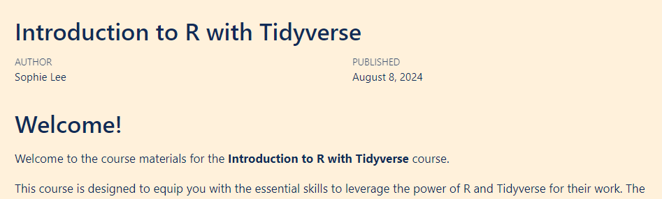
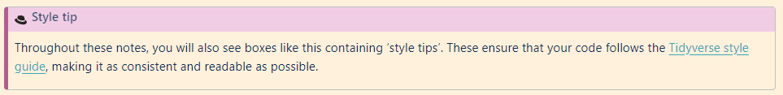
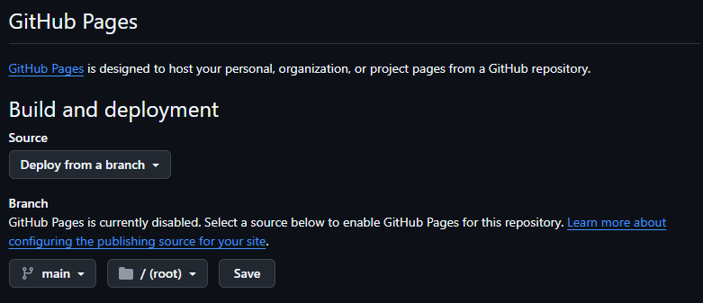

**TL;DR:** This week, I wanted to streamline the workflow of course development, making the most of Github's capabilities. I found Github templates and pages make course initialisation and deployment super simple.

## Motivation
After some very exciting developments, I have four **(!)** sets of course materials to develop by the end of the year. As part of my [goal](https://x.com/SophieStats10/status/1813502853916299679) to ensure all my course materials are accessible to anyone, regardless of their location or financial circumstances, I will be developing all my materials using [Quarto](https://scubed.rbind.io/blog/2024_08_09_twil_quarto/) and hosting them online for free. 

Writing course materials is fun but very time consuming! That is why I would like to streamline the workflow as much as possible. I already use Github for version control and, more recently, to deploy materials online. I wondered whether I could streamline the process of course writing by keeping as much of the workflow within the Github platform as possible. 

**Spoiler alert:** Github absolutely can be used to streamline this process and it takes very little time or effort to set this up! 

In this blog, I wanted to share a little overview of what I learned creating this workflow and how Github templates and Pages can streamline content creation.


## TWIL: This week I learned

### Creating a Github template
The first part of course creation workflow to streamline was the initial set up of course materials. I was inspired [by James Barlett's response to my LinkedIn post](https://www.linkedin.com/feed/update/urn:li:activity:7224446454159798273/) to create a course template that could be used to ensure content is consistent in terms of structure, appearance, and welcome page. 

Template repositories are created the same way as any other repository (if you are new to Github, detailed instructions are given [here](https://docs.github.com/en/repositories/creating-and-managing-repositories/creating-a-new-repository)). Ensure the repository contains any files that are required for future projects. For me, that is any files required to create a Quarto book. These were:

- A `_quarto.yml` file outlining the structure of the document. This includes the title, navigation bar settings, the structure of chapters and appendices, as well as any themes. If you intend to publish materials on Github pages, begin this file with the following (to be explained later!)

```
project:
  type: book
  output-dir: docs
```

- An `index.qmd` file containing the material's welcome page. For me, this included an example course outline, instructions on how to use the materials, licensing information, and links to data descriptions.



- A `data_description.qmd` file to add to the course appendix, giving information about the data used in the course
- A `style.scss` file with your custom themes and any other SCSS code (including [custom callouts!](https://x.com/SophieStats10/status/1821820629433094636))



Once you are happy with the structure of your template, go to the  tab on your repository and tick the 'Template repository' option. This will now give you the option to  to create a new repository when on the template's page. So simple!

If you would like to see an example template repository, mine can be viewed [here](https://github.com/sophie-a-lee/quarto_course_template).


### Github pages to host existing repositories
Until now, I have been using Netlify to host my course materials for free (I wrote more about that [here](https://scubed.rbind.io/blog/quarto_training/)). The main reasons for choosing Netlify was that it was very quick and easy to set up and deploy Quarto resources. But, in the interest of learning, I wanted to see whether this process could be streamlined (and even automated) within the Github interface.

[Github pages](https://docs.github.com/en/pages/getting-started-with-github-pages/about-github-pages) allow you to publish html (or CSS or Javascript) files directly from a Github repository to a website. If, like me, you already host your content in Github repositories, this makes publishing materials online super easy and removes the need to include additional platforms.

By default, Github pages are deployed on Github's domain, with the website address taking the form `username.github.io` (for example, my page is [sophie-a-lee.github.io](https://sophie-a-lee.github.io/)). To create this initial page, add a new repository and give it the name of the site (`<username>.github.io`). Ensure the repository is set to public and it contains a `README`.

To deploy this repository, go to the  tab of the repository, select **Pages** from the menu on the left and choose the Branch you would like to deploy (usually this will be the `main` branch). Depending on how you have configured your repository, select either the root or docs folder to deploy from and click Save. 

**Note** that Github pages will only deploy files from the root folder of a repository, or a folder named `docs`. This is why in the previous section, the template `yml` file contained the option <br> `output-dir:docs`, saving all rendered files to a new folder named `docs`.



Once the your Github page is live, repositories can be deployed in the same way, and made available at `<username>.github.io/<repo-name>`. For example, my Introduction to R with Tidyverse materials can be found at [sophie-a-lee.github.io/Introduction_R_Tidyverse_course](https://sophie-a-lee.github.io/Introduction_R_Tidyverse_course/).

## Next steps
I have already begun using the course material template file and can confirm that the initial work setting up this repository was so worth it. I can already see that in the future this will save so much time which can be invested into writing the content itself. 

The next steps in this learning journey is to determine whether this workflow could be streamlined even further using [Github Actions](https://docs.github.com/en/actions). Manually deploying repositories is very straight forward but after following [Melissa Van Bussel's tutorial](https://www.youtube.com/watch?v=arzBRW5XIkg) on publishing Github Pages using Github Actions, I wonder whether this could be included into course templates to automate their deployment.

If you want to see the final products or attend one of the upcoming courses, be sure to follow my on [Twitter](https://x.com/SophieStats10), [LinkedIn](https://www.linkedin.com/in/sophie-a-lee/) or my new [Bluesky account](https://bsky.app/profile/sophie-stats.bsky.social).