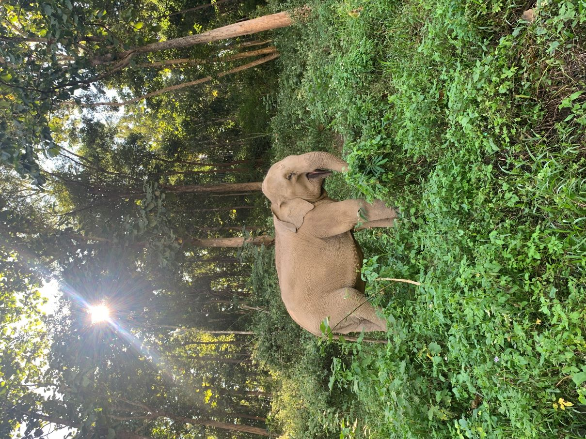

**TL;DR:** This week, I have been reflecting on my first 6 months as a full-time freelancer and the huge amount I have learned in that time. I have condensed these thoughts into 7 lessons I have learned as a new freelancer and ex-digital nomad.

## Background
At the end of February, I returned to the UK after travelling full-time for 18 months[^1] and travelling part-time for many more years (besides an obvious pandemic-imposed break!). While travelling, I worked occasionally as a freelance educator, mostly delivering R training courses to UK government departments (I may talk more about my time as a ‘digital nomad'[^2] another time), but this was certainly not a full-time career and would not be enough income to sustain a comfortable life in the UK.

Converting from an occasional consultant, who regularly took weeks off at a time to visit remote regions with little or no WiFi, to a full-time working gal has been a steep learning curve. The romantic idea of being self-employed meaning that I choose my own hours and would never need to work full-time 9-5 again turned out to not quite match the reality! 

<iframe width="560" height="315" src="https://youtu.be/UbxUSsFXYo4?si=neLKb-rQnHEMNSDa" frameborder="0" allowfullscreen></iframe>

But, where I have lost out on days off and regular pay cheques, I have certainly gained in a sense of purpose, a renewed love of learning, and an occasional sense of achievement that everything I have was built solely by me!

I am still very early in this journey but I wanted to share 7 important lessons I have learned as a new full-time freelancer.

[^1]: if you’re interested in where, see the end of my blog for some self-indulgent photo sharing!

[^2]: **CRINGE**, hate this term

## TWIL: 6 months as a full-time freelancer

### 1. Setting up a business along is a LOT of (unpaid) hard work
Becoming a freelancer means taking on every role in your business, at least until you can afford to pay someone to take over some of these (a far off dream for me!). This includes website developer, accountant, head of marketing, and of course the job that you chose to do!

I had a romantic idea that working for myself would mean working part-time and having space to take days off whenever I felt like it. Although this dream may come true one day when I am more established, this is certainly not going to be the case anytime soon. The to-do list for a new freelancer is long and ever-growing, it is also mostly unpaid in the beginning. 

This is not all bad news though. I have found that a lot of the work I am doing is work that I love and by pushing myself out of my comfort zone, I have learned so many useful skills! For example, building a website has led me to understand more about html and CSS code which I was previously a little scared of. I have also found that sharing these experiences and putting a little effort into social media has led to building a community that I feel comfortable to ask advice from and has led to even more learning!

### 2. The importance of a strong, supportive network
Going out on your own without the safety net of a regular income or confirmed work is scary. That is why it is essential to have people you can rely on, whether that is a partner, close friends, or family members. Your support network will be there with you to celebrate the highs (finally getting paid for work, **YAY!**) and pick you up through the inevitable lows. 

Bonus points if some of your support network do not work in an area even remotely related to what you do to remind you that there is life outside of your bubble! 

For me, my partner and close friends have been my rocks. I do not often talk to them about work but they are my biggest cheerleaders and know when to encourage me away from the laptop and into the pub :beer:.

### 3. Make the most of opportunities in your local area
I am lucky enough to have chosen Sheffield as the place I now call home. Although Sheffield is a city, it often feels more like a collection of villages with a strong community spirit which is very supportive of small businesses (it was ranked the number 1 city in the UK to start a business in 2022).

One way that Sheffield supports small businesses is through their [Business Sheffield](https://www.welcometosheffield.co.uk/business/) network which provides free workshops, networking events, and access to grants. As a first-time business owner with no experience or knowledge of how to set this up, I have found these invaluable in explaining the steps involved to start a business and build my confidence as a freelancer.

Even if you are not lucky enough to have free business training in your area, look out for free networking events on platforms such as [MeetUp](https://www.meetup.com/) or search networking groups that share your interest (for me, that included attending R-user groups in [Manchester](https://www.meetup.com/manchester-r/) and [Sheffield](https://www.meetup.com/sheffieldr-sheffield-r-users-group/), and a data science meetup in [Leeds](https://www.meetup.com/Leeds-Data-Science-Meetup/)). If no networks exist in your area, why not create your own network like we are at [R-Ladies Sheffield](https://www.meetup.com/rladies-sheffield/)!

### 4. People are far more welcoming and generous than you may expect
One of the biggest hurdles I faced when I first got back to the UK was self-doubt. I had a list of people that I followed online that were established in my field and produced work that I admired. It took a lot to psyche myself up enough to contact these people, I was scared that I would be ignored, or worse, they would tell me I was wasting my time.

To my surprise, every one of these emails received a response that was kind and helpful. Some people were so generous that they made time in their schedule to arrange a call with me and offer advice or even leads for paid work. The lesson I learned here was to not overthink people’s reactions. Putting yourself out there may be scary at first but can lead to some wonderful things.

### 5. Know when to walk away
Unfortunately, not all collaborations will be beneficial. Recently, I had to part ways with a company due to concerns about their conduct. This was a very tough decision, particularly at this early stage where my next source of income is so uncertain. However, this taught me a very important lesson about my boundaries and the importance of protecting my wellbeing.

I know that I made the best decision for myself and that long-term this will avoid more unpleasant confrontations but it is easy to second guess yourself when all of the important decisions fall to you. It is important to make your expectations clear when entering into any collaborations and to know where your limits lie.

### 6. Invest in your workspace
Like many freelancers, my work is almost entirely remote. This was a huge bonus when I was travelling, as I could work anywhere in the world, and is still very beneficial as it means that I can live in a city I love. However, the lack of a formal workspace can lead to difficulty in separating personal from professional life, limit productivity, and in some cases lead to feeling isolated without interaction from colleagues. 

One of the best things I have done in my first 6 months as a full-time freelancer has been to invest in a co-working space. This originally seemed like an expense that I would never be able to justify but the increase in productivity and the networking opportunities it has provided has made every penny worth it. Simply working around other contractors and freelancers has given me confidence to believe this career path can work, and has provided the community that is removed when not working in a more ‘traditional’ workplace. 

### 7. Learn to take a break!
The final important lesson is one that I am still trying to work on myself! Taking a break from work becomes much harder when you are the person solely responsible for the success or failure of your venture. However, it is important to remember that time spent taking regular breaks will be less time spent down the line recovering from burn-out (trust me, I know).

Since beginning this new phase of work, I have been very strict about not working late or on weekends. This does not mean that I am taking breaks from *thinking* about work which can still be exhausting. I do not have a solution for this and would love to hear from anyone that has figured out how to do this effectively! 

One trick I have developed is to take 30 minutes at the end of each week listing the week’s achievements, any upcoming deadlines, and setting intentions for the following week. This allows me to recognise there are no urgent issues that need tackling at the weekend and removes the need to spend the weekend composing a mental ‘to-do list’.

## Final thoughts
This past 6 months has been a wild roller coaster of ups and downs: feeling incredibly empowered that I am completely in charge of my career, doing what I love, and overcoming fears, but also knowing that the future is very uncertain. I am optimistic that the next 6 months will contain many more learning opportunities (and hopefully many more work opportunities!). 

If you are still reading this, thank you for being part of this first part of my journey! If you are aware of any consultancy opportunities that I may be a good fit for, then please [let me know!!](/contact/).

## Afterword
This article led me to reminisce on my time as a ‘digital nomad’[^3] and the amazing experiences it allowed me to have. Here are a few of my favourite places it took me to…

[^3]: **BLEURGH**

1. The Sambadrome at sunrise in Rio de Janeiro during carnaval 

2. Exploring the Lost City in Colombia

3. Exploring otherworldly landscapes in the Atacama desert, Chile

4. Completing the Camino de Santiago, all 770km/478 miles of it!

5. Meeting the locals in Thailand

6. The most beautiful sunsets I have ever seen in southern Laos

7. The beautiful views along Vietnam’s Ha Giang loop

