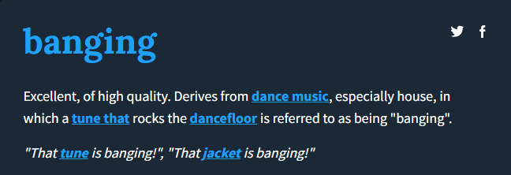

**TL;DR:** Last week, I set myself a goal to convert the slides accompanying the [Statistical thinking](https://stats-thinking.netlify.app/) short course into Quarto. I have listed the 7 most useful things I learned, including how to create custom themes (with variants), how to wrangle slide transitions with fragments, and using absolute positioning to make slide layouts super easy!


## Motivation
Recently I wrote about my experiences converting notes for the latest [Statistical Thinking](/courses/9_statistical_thinking) course into a Quarto book on [my blog](/blog/2024_08_09_twil_quarto). I found this process so useful that I decided to challenge myself to convert the course slides into a [Quarto Reveal.js presentation](https://quarto.org/docs/presentations/revealjs/). A very big task for my first attempt at a Quarto presentation!

Luckily, there are SO MANY great (free!) resources online that made this process way easier than expected to get started. If this is your first Quarto presentation, check out [Jilly MacKay's blog](https://jillymackay.com/post/professionally-sexy-quarto/) for a breakdown of steps to get set up. 

Thanks to these amazing resources, I even overcame my fear of CSS/SCSS coding and created my first custom theme! For anyone else who is feeling overwhelmed by their first foray into CSS styling, I would highly recommend trying it within a presentation format to avoid feeling overwhelmed by more complicated document types.

There is still a huge amount of things to learn and improve but here are the 7 most useful things I learned while writing my first Quarto presentation!

## TWIL: This week I learned

### 1. Create a custom theme using Sass variables

There are [11 built-in themes](https://quarto.org/docs/presentations/revealjs/themes.html#using-themes) for Reveal.js in Quarto. Although there is nothing wrong with using these defaults, to really make a presentation your own, a few tweaks can go a long way! 

To create a custom theme, we first create a `.scss` file. This is done by opening a new 'Text File' in RStudio and saving the file with the suffix `.scss` (for example `custom.scss`).

This theme can then be added to the presentation YAML which will look something like this:

````
---
title: "My presentation"
author: Sophie
format: 
  revealjs:
    theme: custom.scss
---
````

Custom themes are created using [Sass variables](https://sass-lang.com/). If you want ideas on how to customise your theme, [Quarto docs](https://quarto.org/docs/presentations/revealjs/themes.html#sass-variables) gives a comprehensive list of Sass variables (and their defaults) that can be customised in Reveal themes. You can also check the [source code](https://github.com/quarto-dev/quarto-cli/tree/main/src/resources/formats/revealjs/themes) for built-in themes to get inspiration for your own.

Theme files begin with the section header `/*-- scss:defaults --*/`, followed by variables affecting fonts, colours, layouts, code blocks, etc. For help choosing colours, fonts (and just generally excellent advice on Quarto presentations), be sure to visit [Emil Hvitfeldt's blog](https://emilhvitfeldt.com/post/slidecraft-colors-fonts/#finding-colors). 

Here is an example taken from my presentation. This theme changes the presentation background, text and title colours, and imports fonts from Google to apply to the presentation titles and text:

````
/*-- scss:defaults --*/

// colour scheme

$theme-light-back: #fdddb6;
$theme-light-link: #9a3416;
$theme-light-text: #222222;

// colours
$body-bg: $theme-light-back;
$body-color: $theme-light-text;
$link-color: $theme-light-link;

// fonts

@import url('https://fonts.googleapis.com/css2?family=Montserrat:ital,wght@0,100..900;1,100..900&display=swap');
@import url('https://fonts.googleapis.com/css2?family=Noto+Serif:ital,wght@0,100..900;1,100..900&display=swap');

$font-family-sans-serif: "Montserrat", sans-serif;
$presentation-heading-font: "Noto Serif", serif;
$presentation-font-size-root: 40px;
$presentation-line-height: 1.6;

````

The resulting presentation looks like this:

<iframe class="slide-deck" src="theme_slides.html"></iframe>

### 2. Add consistent slide styling using CSS classes

A useful addition to the custom theme we have just created are customised CSS classes. These allow consistent styling to be applied to elements of the presentation with minimal repeated coding. For my presentation, I wanted a CSS class that highlighted important text, making it bold and a brighter colour than the rest of the text. 

CSS classes are added in the custom theme file, under the header `/*-- scss:rules --*/`. We first give the class a name, for example `.highlighted`. Using this prefix, we add the style options that we wish to apply using this class. For example, adding the following to the `custom.scss` theme file

````
/*-- scss:rules --*/

.highlighted {
  color: $theme-light-link;
  font-weight: bold;
}
````

Will create a custom `.highlighted` class which will change the colour of the font to the link colour defined earlier, and make the text bold. This class can be applied to text by surrounding it by square brackets, followed by `{.highlighted}`.

The following Quarto code:

````
## Adding CSS classes

[This text is highlighted]{.highlighted}, this text is not.
````

Produces this slide:

<iframe class="slide-deck" src="css_classes.html"></iframe>


### 3. Extend custom themes to include theme variants

Sometimes one simple theme is not enough, we may want to apply variations of our custom theme to a subset of slides. Reasons we may want to use a theme variant include:

- To aid accessibility for asynchronous materials, allowing the audience to view slides in a light/dark mode 
- To draw the audience's attention to the most important messages of the presentation
- To add separator slides for sections/exercises, making transitions clearer

Whatever your reason for adding theme variant(s), they can be easily added to the theme file as CSS classes, avoiding the need to copy and paste code each time we want to apply the variant. For full details on how to do this, I'd once again recommend heading to [Emil Hvitfeldt's blog](https://emilhvitfeldt.com/post/slidecraft-theme-variants/) for a clear explanation and examples of multiple themes. 

Theme variants can be created and added to the `custom.scss` theme file under the header 

`/*-- scss:rules --*/` 

For example, the following SCSS file specifies the custom theme from earlier, as well as a dark variant of the theme, and two CSS classes that highlights text (one for the default, light theme and one for the dark variant):

````
/*-- scss:defaults --*/

// default colours

$theme-light-back: #fdddb6;
$theme-light-link: #9a3416;
$theme-light-text: #222222;
$theme-dark-back: #1f2e32;
$theme-dark-link: #aae4e6;
$theme-dark-text: #ebe8e3;


// default theme colours
$body-bg: $theme-light-back;
$body-color: $theme-light-text;
$link-color: $theme-light-link;

// import fonts

@import url('https://fonts.googleapis.com/css2?family=Montserrat:ital,wght@0,100..900;1,100..900&display=swap');
@import url('https://fonts.googleapis.com/css2?family=Noto+Serif:ital,wght@0,100..900;1,100..900&display=swap');

$font-family-sans-serif: "Montserrat", sans-serif;
$presentation-heading-font: "Noto Serif", serif;
$presentation-font-size-root: 40px;
$presentation-line-height: 1.6;


/*-- scss:rules --*/

// dark theme variant

.dark-theme {
  color: $theme-dark-text;
  background-color: $theme-dark-back;
  
  // header text
  
  h1, h2, h3 {
    color: $theme-dark-text;
  }
  
  // link text
  
  a { 
    color: $theme-dark-link;
  }
  
  // slide background
  
  .slide-background-content {
    background-color: $theme-dark-back;
  }
}

// CSS class for highlighting light theme 

.highlighted-light {
  color: $theme-light-link;
  font-weight: bold;
}

//CSS class for highlighting dark theme
.highlighted-dark {
  color: $theme-dark-link;
  font-weight: bold;
}
````

The theme variant is applied to slides within the Quarto code by adding the class next to the slide heading:

````
## Dark themed slide {.dark-theme}
````

Any slides without the variant specified will follow the default theme set under the `/*-- scss:rules --*/` heading. Applying the custom theme pasted above will give the following results:

<iframe class="slide-deck" src="theme_variant.html"></iframe>

### 4. Keep element layouts consistent with absolute positioning

In presentations, we may have elements (e.g. images and tables) visible across multiple slides to draw attention to different aspects of it. If the position of the element is not fixed across slides, other differences across slides may cause this to move.This can result in clunky slide transitions and the movement can distract readers from other aspects of the slide. 

In Quarto, the [absolute CSS class](https://quarto.org/docs/presentations/revealjs/advanced.html#absolute-position) allows us to specify the exact position of items on a slide based on their relative difference from the `top`, `bottom`, `left` or `right`. We can also specify an item's `height` and `width` within this class. To set the absolute position of an item, use the syntax `{.absolute}`, followed by the location inside the brackets (e.g. `top=200 left=400`).

For example, the following syntax:

````
## Absolute positioning example

[I love]{.absolute top=100 left=0}

[absolute positioning]{.absolute top="50%" left-"50%"}

[and cake.]{.absolute bottom=0 right=0}
````

Adds three pictures onto a slide in different positions:

<iframe class="slide-deck" src="/absolute_positioning.html"></iframe>

**Note:** absolute positioning can be used to situate any element of a slide, such as tables, text and headings, not just images. To use absolute positioning on text, surround it by square brackets and follow it with `{.absolute}` and the location on the slide. For example

````
[This text will lie in the middle of the slide]{.absolute top="50%" left="50%"}
````

### 5. Automatically adjust headers to fit a slide

A super simple but VERY useful trick I used a lot was making use of the `r-fit-text` class. This automatically chooses the largest font possible that ensures text fills the slide, without overflowing. This saves lots of time testing different font sizes, and was particularly useful when creating separator slides for each new section and exercise in a long course.

To use the `r-fit-text` class, surround the text with Divs `:::` and begin `{.r-fit-text}`. For example, the following code creates a dark themed slide with the section number and title within a presentation:

````
# {.dark-theme}

:::{.r-fit-text}
Section 3: 

Summary statistics
:::
````


### 6. Control slide animations with fragments

In Quarto presentations, any text, images, tables and lists are displayed all at once unless otherwise specified. Bullet and numbered lists can be displayed one at a time using the `incremental` option. This is either applied to the entire presentation within the `.qmd`'s YAML:

````
---
format:
  revealjs:
    incremental: true
---
````

Or for single lists by surrounding them by Divs (`:::`) and setting as class `.incremental`:

````
::: {.incremental}
- This list
- Is incremental
:::
````

The incremental class is easy to apply to lists but any other element of a slide must be defined as a [fragment](https://quarto.org/docs/presentations/revealjs/advanced.html#fragments). There are several in-built fragment styles that can be used to add animations to slides, such as appear, disappear, highlight and strikethrough. The default fragment style has the element appear on a click. This is added using the syntax `{.fragment}`. Any other style must be added within the brackets, such as `{.fragment fade-out}`. The [Quarto documentation](https://quarto.org/docs/presentations/revealjs/advanced.html#fragments) provides a full list of fragment options.

Fragments can be added in the same way as any other class. If the fragment is defined on a single row, for example an image, a line of text, or a snippet of text within a longer line, we define the class using `{}` brackets. For example:

````
[This text will shrink]{.fragment .shrink}
````

Longer chunks, particularly those across multiple rows, such as code chunks (or tables/graphs created within code chunks), should be defined using Divs (`:::`), followed by the fragment class. For example, the following code has a line graph appear after a click:

````
::: {.fragment}
```{r}
ggplot(data = df) +
  geom_line(aes(x = year, y = crimes, colour = region)) +
  scale_colour_manual(values = region_palette) +
  theme_minimal(base_size = 12)
```
:::
````

**Note:** (fragment order)[https://quarto.org/docs/presentations/revealjs/advanced.html#fragment-order] can also be specified within the `{}` brackets. By default, fragments will begin in the order they are given in the `.qmd` file. However, the `fragment-index` option can override this, changing the order or allowing multiple fragments to appear at the same time. For example:

````
[This will appear second]{.fragment fragment-index=2}

[This will appear first]{.fragment fragment-index=1}

[This will appear second, at the same time as the top line]{.fragment fragment-index=2}
````

### 7. Add presenter notes 

Adding notes that appear only for the presenter in (speaker view)[https://quarto.org/docs/presentations/revealjs/presenting.html#speaker-view] can be done by using the `.notes` class, surrounding the text with Divs (`:::`). For example, the following code will create a slide with a numbered list. The notes are added to the slide but are only visible within presenter view:

````
## This is a list

1. This comes first
2. Then this
3. And finally, this

:::{.notes}
Here are my presentation notes!
:::
````

Speaker view is enabled by clicking `s` on your keyboard.

## Final thoughts

I was very impressed with how easy it was to 
