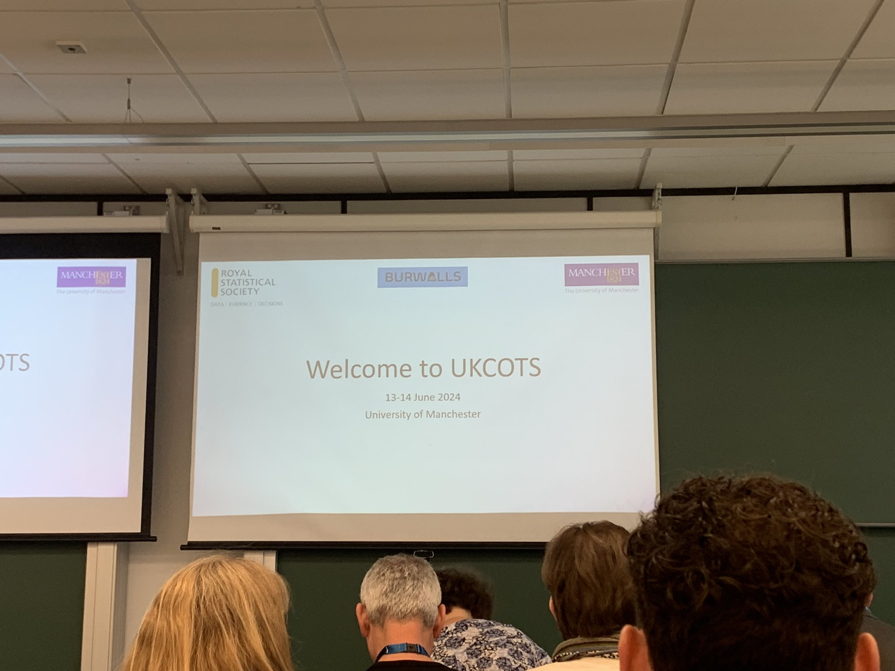
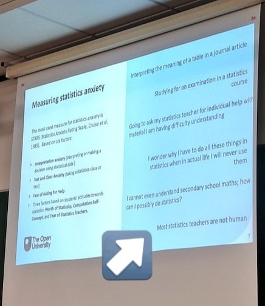
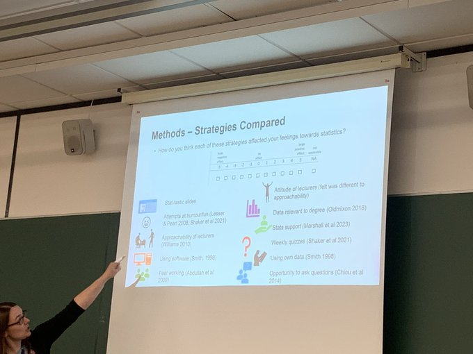

As someone that loves statistics and teaching, COTS (conference of teaching statistics) has always felt like my professional happy place. My first introduction to COTS was in 2016, as a newly-appointed Teaching Fellow, given the opportunity to present my work in Australia (and a chance to escape London winter? *Sign me up!*). I arrived at the OZCOTS conference in Canberra a little nervous and a lot jet lagged. I found a welcoming, inclusive community of like-minded people that loved teaching statistics and were committed to sharing the best ways to do this.

Since that first conference, I also attended the international (ICOTS) and US (USCOTS) versions in 2018 and 2019, and once again found a community that was welcoming and excited to share their research into the most effective ways to teach statistics. But I always left these conferences wondering: **when is the UK getting its own COTS**? 

I now have an answer to this question: June 2024! Even better, it was taking place in Manchester, a short (and very picturesque) train ride across the Peak District!

Here, I share a few of my favourite talks and takeaways from the first [UKCOTS](ukcots.org):

### Software is a superpower when teaching statistics
There were a number of sessions across the conference that showed how technology can aid statistical educators make courses more accessible, engaging, and collaborative. Some of my favourite tools that I plan to use in the future include:

- Virtual environments (such as [Binder](https://mybinder.org/)) to *improve accessibility in software courses* and ensure everyone can use the most recent programmes without the need to install anything
- [Collaborative keys](https://raovnv.github.io/BiostatLiteracyProject/#project-contributors), an open, online documents where participants *collaborate to generate and refine answers to exercises*, and through this *develop their own learning resources*
- R-Shiny and Quarto to develop *interactive, engaging teaching materials*. For example, to show the relationship prior, likelihood, and posterior distributions when teaching R. 

### Maths (and statistics) is a language: how we speak it matters
One of the most interesting talks came from Theresa O’Brien of the University of New South Wales. Theresa showed how the linguistics of maths and statistical equations can be a barrier to students, particularly those not from a quantitative background. As statistics educators, it is easy to move implicitly between sentence structures and word classes when describing equations as we have become ‘fluent’ in this language. By making the effort to *ensure implicit steps are made explicit, expanding algebraic expressions to their fullest form, and showing each step of this process* rather than statically on a slide, we can *develop mathematical fluency* in students, and *improve statistical communication*.

#### The most effective tool to help students overcome statistical anxiety? Statistical educators!
Possibly my favourite takeaway of the whole conference came from University of Leeds’ Anna Riach. The study involved implementing various techniques into lectures that were shown in literature to reduce students’ statistical anxiety, and was carried out across multiple institutions, Techniques used including peer working, slides to address statistical anxiety, and using real world data. Students were asked to rate the techniques based on how they helped alleviate their statistical anxiety. Their findings? *Students in all institutions said it was the attitude and approachability of their teachers that had the biggest impact in reducing statistical anxiety!*

Attending a conference for the first time without a university affiliation was slightly nerve-wracking. I am so happy that my first experience was with this welcoming community! Already looking forward to the next edition of UKCOTS!

Do you have favourite tools and techniques to make your classroom more accessible and engaging? I'd love to hear from you in the comments!