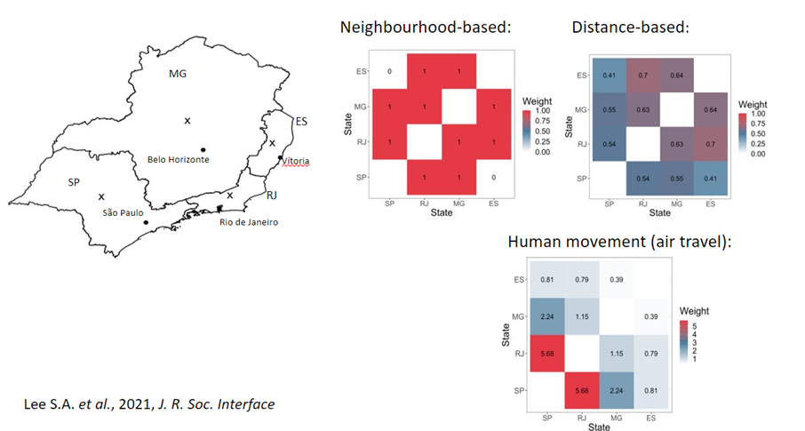

**Course level: Intermediate**
 
**Next live dates: [16 - 19 December](https://www.prstats.org/course/spatial-data-analysis-with-r-sdar01/)**

### Course description
Spatial data analysis allows us to go beyond traditional investigation of data, and uncover relationships and patterns based on where things are. This adds an extra layer of understanding of our data which can aid us when making inferences and predictions. 

Spatial data analysis has a wide range of applications across many different sectors. For example, improving access to healthcare, increasing efficiency in transport networks, identifying areas of expansion in retail and hospitality, and developing approaches to environmental preservation. Spatial data analysis has grown considerably in popularity due to increased access to spatial data and spatial analysis tools. This course will focus on using R software, which has a wide range of packages, designed to make spatial data visualisation and analysis more accessible.

This online course will give participants the skills to load, explore, visualise, and analyse spatial data within R. We will begin with an introduction to the different types of spatial data: areal, geospatial, and point data. Participants will learn to load, explore, and visualise data, quantify the strength of relationship, or autocorrelation, between data, and understand different modelling approaches available for each type of spatial data. All analysis will be applied using R, with an emphasis on creating clear, tidy, reproducible code.

The course will consist of a combination of theory-based sessions and hands-on practical exercises to ensure that participants have the tools to apply the approaches taught in this course to their own data immediately. 

---

### Outline
Topics covered in this course include:
- What is spatial data and why should we use it?
- Types of spatial data
- Spatial data in R: how to store, load, and tidy spatial data
- Visualising spatial data
- Exploring spatial data: spatial autocorrelation and spatial statistics to quantify relationships
- Geostatistical methods and kriging
- Spatial regression models: what are the options?

---

### Target audience
This course is designed for anyone who would like to use spatial data to unlock the potential of their analysis and gain a more nuanced view of their data. 

Participants do not need any previous experience or knowledge of spatial data analysis. Some knowledge of generalised linear models is useful but not required as a short recap is included in the course. Participants should be comfortable with the RStudio interface and have some previous experience of using Tidyverse to load and tidy data. 

### Learning outcomes
Upon completion of the Spatial data analysis with R course, participants will understand the different types of spatial data. They will be able to load, process, and explore spatial data in R. Participants will produce a range of striking visualisations to help understand and communicate their spatial data. Finally, they will have the tools to analyse and interpret spatial data, including measures of autocorrelation and interpolation.
