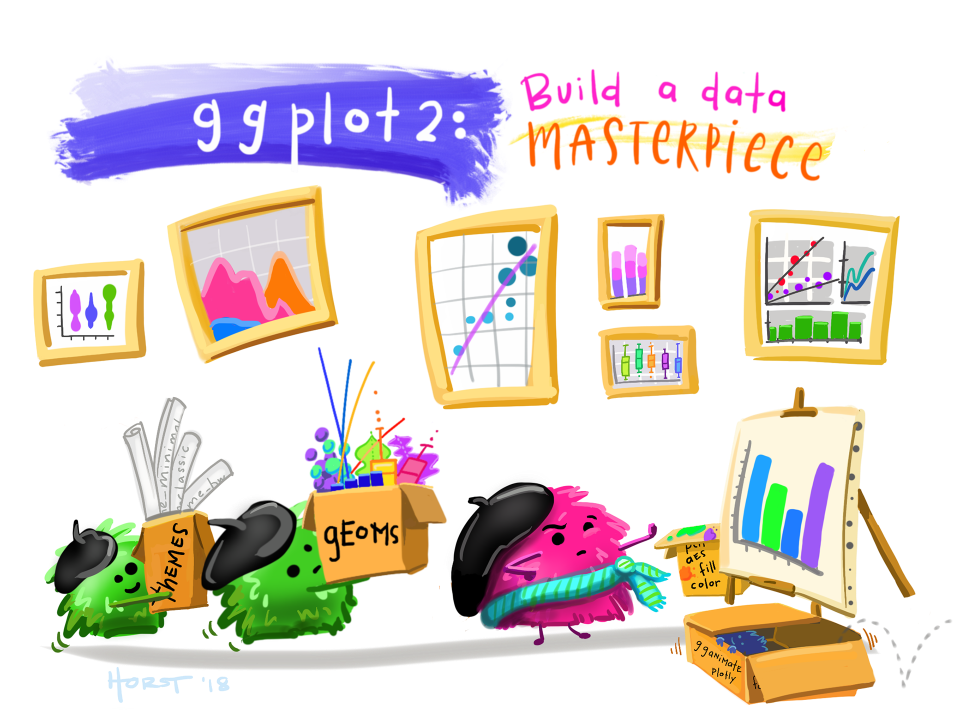

**Course level: Foundation**

**Next live dates: TBC** [(Contact us to request training details)](/contact)

---

### Course description

Data visualisation is one of the most important steps in any analysis journey. Visualisations allow us to explore our data, identify errors and outliers, generate hypotheses about possible relationships between variables, and communicate results clearly and efficiently. `ggplot2` is a powerful R package that was designed to create publication-quality graphics in seconds. The joy of `ggplot2` is its flexibility: graphs are built in layers which can be easily customised, ensuring novel plots to fit almost any situation. 

This course will introduce the `ggplot2` package and its underlying grammar of graphics. Participants will understand how to choose the most appropriate type of visualisation, based on the type and number of variables, and the intention of the plot. We will then build visualisations, layer by customisable layer, to transform simple plots into beautiful, informative graphics. 

---

### Outline

Topics covered in this course include:

- How to load, tidy, and prepare data for visualisation
- Introduction to `ggplot2`: how to produce a simple graph
- Enhance visualisations by customising layers: scales, themes, and annotations
- Faceting: multiple visualisations in one place
- Creating personalised colour palettes and themes for consistent visualisations

--- 

### Target audience
This course is designed for anyone that would like to take their graphs to the next level, and create compelling visualisations. 

Participants are not expected to be experts in R or have any prior experience of using the `ggplot2` package. However, some  experience of loading and tidying data in RStudio using Tidyverse packages would be useful (the course does start with a very brief re-cap of this if you are a beginner or a bit rusty!).

---

### Learning outcomes
By the end of this course, participants will have the tools to create compelling, well-designed data visualisations using R. They will know how to choose the most appropriate visualisation, and how to build this visualisation layer by layer to ensure it is as clear as possible. These will be created using reproducible, tidy code, which will include personalised colour palettes and themes to ensure consistency throughout their work.