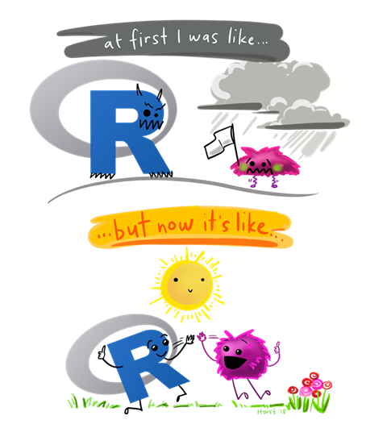

**Course level: Foundation**

**Next live dates:** [**15 - 16th June, 2024.**](https://instats.org/seminar/introduction-to-r-with-tidyverse-2542)

### Course description
R is a popular open-source programming language used by data scientists, statisticians, social & health researchers, and many more across a wide range of disciplines. R is particularly appealing to researchers as it is free to access, designed to encourage collaborative and reproducible data analysis, and is constantly evolving to include the latest research developments. 

This two-day workshop is designed to equip PhD students, academics, and professional researchers across various disciplines with the essential skills to leverage the power of R and Tidyverse for their academic research. The workshop begins with a gentle introduction to the user-friendly RStudio interface and the basics of the R coding language, or syntax. This makes it ideal for anyone with little or no prior coding experience, or those looking for a refresher of the basics. 

Attendees will learn how to manipulate, transform, and clean data efficiently, and how to create compelling visualizations to communicate their findings effectively. Throughout the course, we will discuss best practices for reproducible coding. The workshop is designed to be highly interactive with a focus on practical applications, ensuring that you can immediately apply what you learn to your research. 

---

### Outline
Topics covered in this workshop include:
- Introduction to R using the RStudio interface
- Introduction to data management in R (including how to import data, how to tidy data and how to transform it ready for analysis)
- Data visualisation using ggplot2
- Exploratory data analysis and how to create clear summary tables
- Introduction to RMarkdown to create high quality documents to communicate results
- Best practices for reproducible research

---

### Target audience
Anyone that is interested in learning more about R coding and how it can contribute to making their research more efficient, collaborative and reproducible. 

This workshop is ideal for anyone with little or no prior experience with R coding, or those that have not used the programme for a while and would like a refresher. Although participants with prior experience of other coding languages, such as Python and Julia, are welcome to join, they may find the beginning of the course a little slow. 

---

### Learning outcomes
Upon completion of the 'Introduction to R with Tidyverse' workshop, participants will have gained an understanding of basic R programming and the Tidyverse packages. They will have acquired the skills to efficiently manipulate, transform, and clean data, and to create compelling visualizations to effectively communicate their research findings. Furthermore, they will have learned how to generate high quality documents containing these visualizations and findings using R Markdown and automate repetitive tasks, enhancing their research productivity and reducing the potential for errors.
