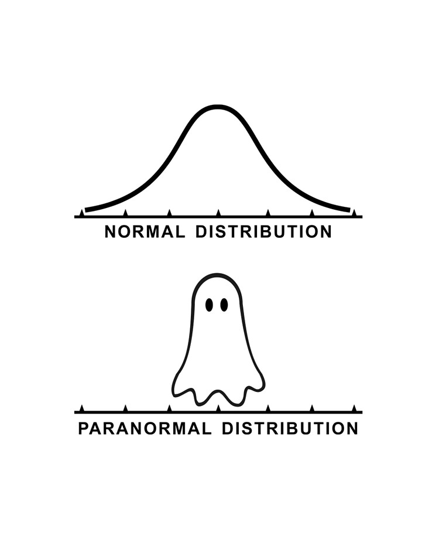

**Course level: Foundation**

**Self-paced online course [coming soon!](https://equationsofdisease.com/)**

---

### Course description
Statistics is the science of data. This includes the collection and storage of data, the visualisation and analysis of samples of data, the interpretation of results, and the communication of these to a wider audience. In this course, participants will be introduced to the fundamental concepts of statistical analysis and the steps required to carry out valid, robust inferences on data.

By the end of this course, participants will be able to formulate an appropriate research question, including fully specifying a target population and output variable of interest. They will use R software to visualise and explore their data, and will carry out common statistical tests to make inferences on their target population of interest. Finally, they will be confident in the theory behind regression analysis, and be able to carry out and interpret regression models using their own data in R.

Developed for and hosted by the wonderful [Equations of Disease](https://equationsofdisease.com/)

---

### Outline
Topics covered in this course include:
- The importance of a clear, well-defined research question and how to formulate this
- Data visualisation as a tool to explore data, generate hypotheses, and convey important messages
- How to summarise data and quantify trends/differences between variables
- Hypothesis testing and how to make inferences based on a sample
- Introduction to generalised linear models

--- 

### Target audience
This course was designed for anyone with little or no background in mathematics or statistics, who would like a comprehensive introduction to statistical analysis. It is particularly useful for anyone who is hoping to apply statistical methods to their own data using R, as this course provides the tools to apply methods immediately after the course.

---

### Learning outcomes
By the end of this course, participants will be able to:
- Formulate a well-defined research question to address using statistical methods
- Generate visualisations to explore data, generate hypotheses, and communicate their results in a clear, concise manner
- Choose the most appropriate summary statistics to explore their sample and quantify trends and differences within the data
- Perform hypothesis tests and interpret their results to make inferences about their target population from a sample
- Perform regression analysis to gain a deeper understanding of their data and account for multiple variables within their analysis
