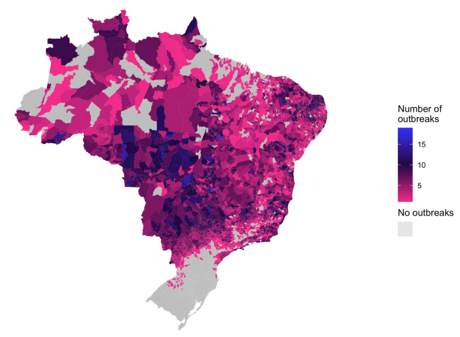
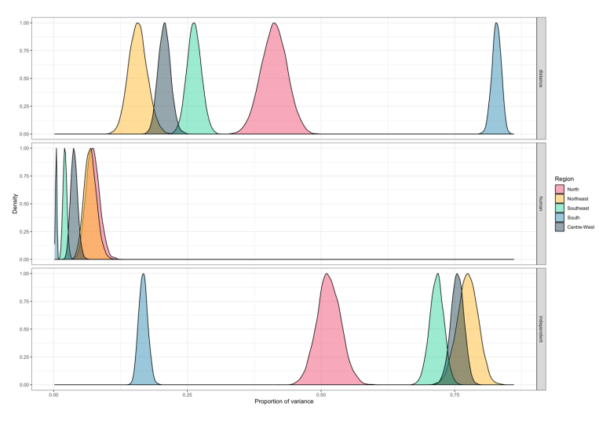

 
Here is the result of 4 years' of hard work...my finished PhD thesis! This work explores the existing spatial modelling framework that is used to model mosquito-borne disease, and proposes a new approach that is capable of capturing multiple sources of spatial connectivity. Existing and novel statistical models are applied to dengue data from Brazil since 2001 to explore the impact of climate, cities, and connectivity on the expansion of dengue outbreaks across the country.

The thesis contains three published papers which can also be found [on this website](/publications/). A final chapter is included applying the Bayesian spatial framework to the data, quantifying the differences in the importance of human movement on dengue outbreaks between regions of Brazil.

Appendices include a detailed explanation of empirical Bayesian approaches that were utilised for the analysis in chapters 4 and 5, and a list of spatial models that were identified in published papers as part of the [systematic review](/publications/systematic_review). Both are detailed resources that were written to assist anyone wanting to carry out Bayesian spatial modelling on their own data.
