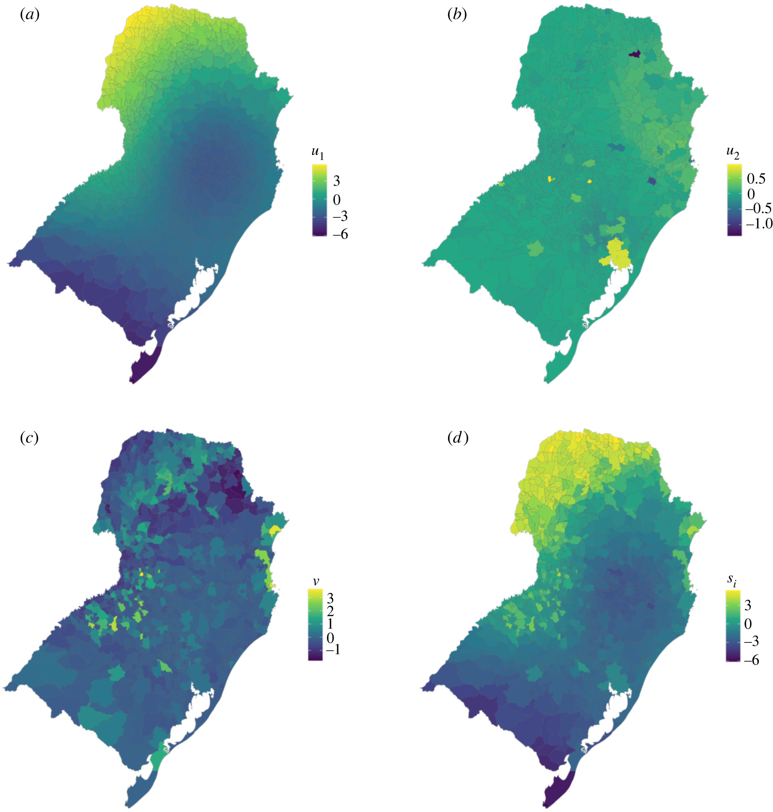

### Abstract
Spatial connectivity is an important consideration when modelling infectious disease data across a geographical region. Connectivity can arise for many reasons, including shared characteristics between regions and human or vector movement. Bayesian hierarchical models include structured random effects to account for spatial connectivity. However, conventional approaches require the spatial structure to be fully defined prior to model fitting. By applying penalized smoothing splines to coordinates, we create two-dimensional smooth surfaces describing the spatial structure of the data while making minimal assumptions about the structure. The result is a non-stationary surface which is setting specific. These surfaces can be incorporated into a hierarchical modelling framework and interpreted similarly to traditional random effects. Through simulation studies, we show that the splines can be applied to any symmetric continuous connectivity measure, including measures of human movement, and that the models can be extended to explore multiple sources of spatial structure in the data. Using Bayesian inference and simulation, the relative contribution of each spatial structure can be computed and used to generate hypotheses about the drivers of disease. These models were found to perform at least as well as existing modelling frameworks, while allowing for future extensions and multiple sources of spatial connectivity.