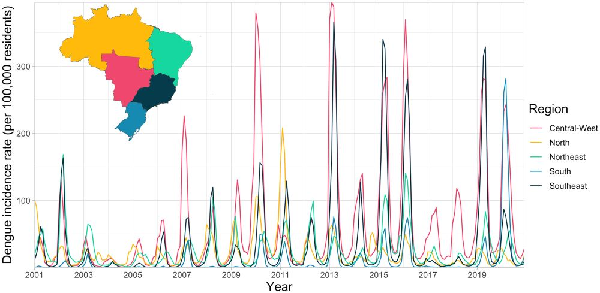

### Abstract
Dengue is hyperendemic in Brazil, with outbreaks affecting all regions. Previous studies identified geographical barriers to dengue transmission in Brazil, beyond which certain areas, such as South Brazil and the Amazon rainforest, were relatively protected from outbreaks. Recent data shows these barriers are being eroded. In this study, we explore the drivers of this expansion and identify the current limits to the dengue transmission zone. We used a spatio-temporal additive model to explore the associations between dengue outbreaks and temperature suitability, urbanisation, and connectivity to the Brazilian urban network. The model was applied to a binary outbreak indicator, assuming the official threshold value of 300 cases per 100,000 residents, for Brazil’s municipalities between 2001 and 2020. We found a nonlinear relationship between higher levels of connectivity to the Brazilian urban network and the odds of an outbreak, with lower odds in metropoles compared to regional capitals. The number of months per year with suitable temperature conditions for Aedes mosquitoes was positively associated with the dengue outbreak occurrence. Temperature suitability explained most interannual and spatial variation in South Brazil, confirming this geographical barrier is influenced by lower seasonal temperatures. Municipalities that had experienced an outbreak previously had double the odds of subsequent outbreaks. We identified geographical barriers to dengue transmission in South Brazil, western Amazon, and along the northern coast of Brazil. Although a southern barrier still exists, it has shifted south, and the Amazon no longer has a clear boundary. Few areas of Brazil remain protected from dengue outbreaks. Communities living on the edge of previous barriers are particularly susceptible to future outbreaks as they lack immunity. Control strategies should target regions at risk of future outbreaks as well as those currently within the dengue transmission zone.