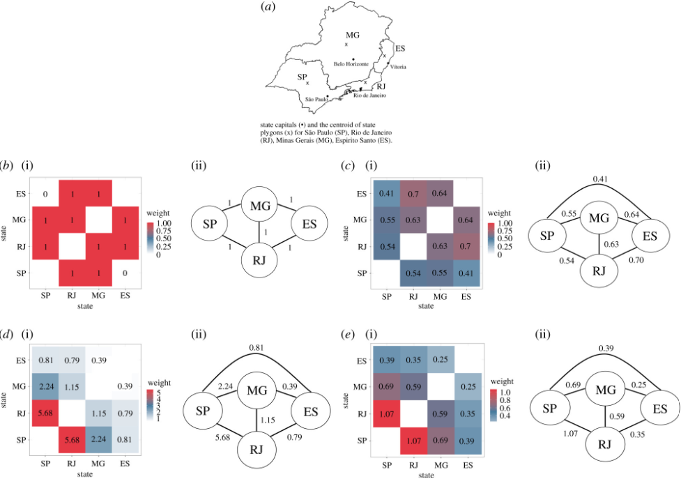

### Abstract
Spatial connectivity plays an important role in mosquito-borne disease transmission. Connectivity can arise for many reasons, including shared environments, vector ecology and human movement. This systematic review synthesizes the spatial methods used to model mosquito-borne diseases, their spatial connectivity assumptions and the data used to inform spatial model components. We identified 248 papers eligible for inclusion. Most used statistical models (84.2%), although mechanistic are increasingly used. We identified 17 spatial models which used one of four methods (spatial covariates, local regression, random effects/fields and movement matrices). Over 80% of studies assumed that connectivity was distance-based despite this approach ignoring distant connections and potentially oversimplifying the process of transmission. Studies were more likely to assume connectivity was driven by human movement if the disease was transmitted by an Aedes mosquito. Connectivity arising from human movement was more commonly assumed in studies using a mechanistic model, likely influenced by a lack of statistical models able to account for these connections. Although models have been increasing in complexity, it is important to select the most appropriate, parsimonious model available based on the research question, disease transmission process, the spatial scale and availability of data, and the way spatial connectivity is assumed to occur.
