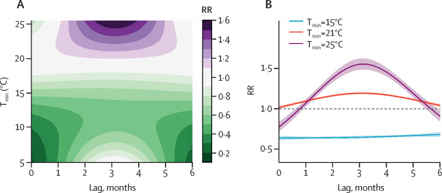

### Summary
#### Background
Temperature and rainfall patterns are known to influence seasonal patterns of dengue transmission. However, the effect of severe drought and extremely wet conditions on the timing and intensity of dengue epidemics is poorly understood. In this study, we aimed to quantify the non-linear and delayed effects of extreme hydrometeorological hazards on dengue risk by level of urbanisation in Brazil using a spatiotemporal model.

#### Methods
We combined distributed lag non-linear models with a spatiotemporal Bayesian hierarchical model framework to determine the exposure-lag-response association between the relative risk (RR) of dengue and a drought severity index. We fit the model to monthly dengue case data for the 558 microregions of Brazil between January, 2001, and January, 2019, accounting for unobserved confounding factors, spatial autocorrelation, seasonality, and interannual variability. We assessed the variation in RR by level of urbanisation through an interaction between the drought severity index and urbanisation. We also assessed the effect of hydrometeorological hazards on dengue risk in areas with a high frequency of water supply shortages.

#### Findings
The dataset included 12 895 293 dengue cases reported between 2001 and 2019 in Brazil. Overall, the risk of dengue increased between 0–3 months after extremely wet conditions (maximum RR at 1 month lag 1·56 [95% CI 1·41–1·73]) and 3–5 months after drought conditions (maximum RR at 4 months lag 1·43 [1·22–1·67]). Including a linear interaction between the drought severity index and level of urbanisation improved the model fit and showed the risk of dengue was higher in more rural areas than highly urbanised areas during extremely wet conditions (maximum RR 1·77 [1·32–2·37] at 0 months lag vs maximum RR 1·58 [1·39–1·81] at 2 months lag), but higher in highly urbanised areas than rural areas after extreme drought (maximum RR 1·60 [1·33–1·92] vs 1·15 [1·08–1·22], both at 4 months lag). We also found the dengue risk following extreme drought was higher in areas that had a higher frequency of water supply shortages.

#### Interpretation
Wet conditions and extreme drought can increase the risk of dengue with different delays. The risk associated with extremely wet conditions was higher in more rural areas and the risk associated with extreme drought was exacerbated in highly urbanised areas, which have water shortages and intermittent water supply during droughts. These findings have implications for targeting mosquito control activities in poorly serviced urban areas, not only during the wet and warm season, but also during drought periods.
